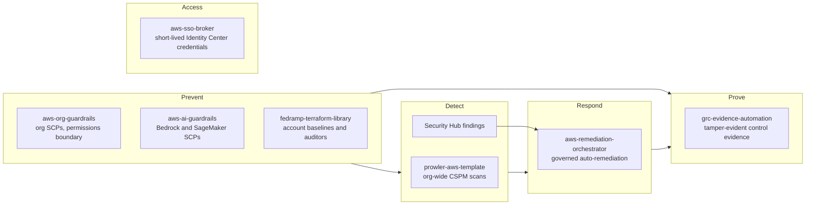

# Dustin Arrington

**Senior Cloud Engineer** focused on AWS multi-account governance and compliance-as-code: FedRAMP (Rev5 and 20x) and NIST 800-53 controls implemented as code on AWS, in both commercial regions and GovCloud.

I build multi-account guardrails, audit evidence pipelines, and remediation workflows that run on short-lived credentials only (OIDC and IAM Identity Center, zero long-lived keys). Every repo below has automated tests (terraform test, pytest) and is scanned in CI with Checkov, Trivy, and Gitleaks. Each one documents its coverage gaps rather than hiding them. I use AI coding assistants (Claude Code) for drafting and review. I design each system, and I verify it with tests and, where noted, live deployments.

## Start here

- [**fedramp-terraform-library**](https://github.com/DustyStudy/fedramp-terraform-library): NIST 800-53 Rev5 and FedRAMP 20x controls as Terraform modules, with plan-time tests that check the rendered IAM and bucket policies.
- [**aws-remediation-orchestrator**](https://github.com/DustyStudy/aws-remediation-orchestrator): Security Hub findings routed through policy, blast-radius limits and a human approval gate. [Tested against a real AWS account](https://github.com/DustyStudy/aws-remediation-orchestrator/blob/main/docs/PROOF.md).
- [**grc-evidence-automation**](https://github.com/DustyStudy/grc-evidence-automation): scheduled, tamper-evident control evidence for SOC 2, ISO 27001, NIST 800-53 and FedRAMP 20x. [Deployed and verified in a live account](https://github.com/DustyStudy/grc-evidence-automation/blob/main/docs/live-deployment-verification.md).
- [**aws-org-guardrails**](https://github.com/DustyStudy/aws-org-guardrails): SCPs, a permissions boundary and Identity Center permission sets for AWS Organizations, tested as policy behavior against the JSON Terraform renders.
- [**aws-sso-broker**](https://github.com/DustyStudy/aws-sso-broker): short-lived IAM Identity Center credentials across many accounts, with no long-lived access keys. [Tested against a real Identity Center instance](https://github.com/DustyStudy/aws-sso-broker/blob/main/docs/PROOF.md).

## Threat-informed hardening

Gaps I found in my own tooling after reviewing AWS attack techniques in active use, and the change that closed each one. Full log, with sources: [THREAT-RESPONSE.md](THREAT-RESPONSE.md).

- **AWS credentials left on laptops:** the SSO broker locked down its own cache but ignored long-lived keys and AWS CLI SSO tokens on the same machine. `ssobroker doctor` now flags them in [aws-sso-broker#14](https://github.com/DustyStudy/aws-sso-broker/pull/14). Seen in the wild: [Wiz, 2026](https://www.wiz.io/blog/infostealer-incursion-cloud-ai-credentials).
- **Malicious Terraform providers:** the library's CI never checked provider sources, so a typosquatted namespace would have passed. Added a provider allowlist test in [fedramp-terraform-library#32](https://github.com/DustyStudy/fedramp-terraform-library/pull/32). Seen in the wild: [Aikido, 2026](https://www.aikido.dev/blog/graphalgo-terraform-go-modules).
- **LLMjacking with leaked access keys:** the AI guardrails limited which Bedrock models ran, not who could run them. Added an opt-in SCP denying Bedrock to IAM users in [aws-ai-guardrails#29](https://github.com/DustyStudy/aws-ai-guardrails/pull/29). Seen in the wild: [FortiGuard Labs, 2026](https://www.fortinet.com/blog/threat-research/someone-else-is-using-your-ai).

## How the repos fit together

## Also here

- [**ai-agent-security-toolkit**](https://github.com/DustyStudy/ai-agent-security-toolkit): prompt-injection fuzzer, tool-call sandbox with taint tracking, output validation and a tamper-evident audit log for LLM agents.
- [**aws-ai-guardrails**](https://github.com/DustyStudy/aws-ai-guardrails): Terraform guardrails for Bedrock and SageMaker: SCPs, agent IAM audits, invocation-logging enforcement and cost controls.
- [**prowler-aws-template**](https://github.com/DustyStudy/prowler-aws-template): org-wide Prowler scans for under $1/month with GitHub Actions, OIDC and StackSet read-only roles.
- [**fedramp-cloud-compliance-skill**](https://github.com/DustyStudy/fedramp-cloud-compliance-skill): Claude Code Agent Skill for the FedRAMP 2026 Consolidated Rules (Rev5 and 20x) on AWS, Azure and GCP.

## Tools and platforms

**Cloud:** AWS (including GovCloud) 
**Infrastructure as code:** Terraform, GitHub Actions 
**Languages:** Python, HCL, PowerShell, Bash 
**Security tooling:** Checkov, Trivy, Gitleaks, Prowler, Security Hub, GuardDuty, AWS Config 
**Frameworks:** FedRAMP Rev5 and 20x, NIST 800-53 Rev5, SOC 2, ISO 27001:2022
