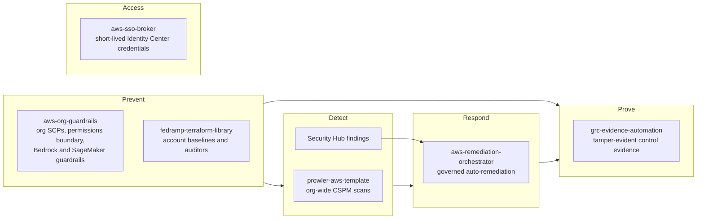

# Dustin Arrington

**Senior Cloud Engineer** focused on AWS multi-account governance and compliance-as-code: FedRAMP (Rev5 and 20x) and NIST 800-53 controls implemented as code on AWS, in both commercial regions and GovCloud.

I build multi-account guardrails, audit evidence pipelines, and remediation workflows that run on short-lived credentials only (OIDC and IAM Identity Center, zero long-lived keys).

Every repo below has automated tests (terraform test, pytest), is scanned in CI with Checkov, Trivy, and Gitleaks, and documents its coverage gaps. Where noted, it links to proof from a live deployment.

## Start here

- [**fedramp-terraform-library**](https://github.com/DustyStudy/fedramp-terraform-library): NIST 800-53 Rev5 and FedRAMP 20x controls as Terraform modules, with plan-time tests that check the rendered IAM and bucket policies. [Thirteen modules deployed and probed in a real organization](https://github.com/DustyStudy/fedramp-terraform-library/blob/main/docs/LIVE-PROOF.md), including live connections to the database, the container registry and the web ACL.
- [**aws-remediation-orchestrator**](https://github.com/DustyStudy/aws-remediation-orchestrator): Security Hub findings routed through policy, blast-radius limits and a human approval gate. [All six playbooks run against a real AWS organization](https://github.com/DustyStudy/aws-remediation-orchestrator/blob/main/docs/PROOF.md).
- [**aws-sso-broker**](https://github.com/DustyStudy/aws-sso-broker): short-lived IAM Identity Center credentials across many accounts, with no long-lived access keys. [Tested against a real Identity Center instance](https://github.com/DustyStudy/aws-sso-broker/blob/main/docs/PROOF.md).

## How the repos fit together

## Threat-informed hardening

I track AWS attack techniques in active use and update these repos as new ones are reported. Each entry is a technique, the control I added for it, and public reporting of attackers using it. Full log, with sources: [THREAT-RESPONSE.md](THREAT-RESPONSE.md).

- **Leaked access keys used to send mail:** the SCP bundles already denied creating IAM users and access keys. An opt-in statement now also denies Amazon SES to IAM users, so an existing key that leaks cannot send mail or be used as an SES SMTP password, in [aws-org-guardrails#18](https://github.com/DustyStudy/aws-org-guardrails/pull/18). Seen in the wild: [LevelBlue SpiderLabs, 2026](https://www.levelblue.com/blogs/spiderlabs-blog/tiktouk-tracing-a-wordpress-credential-collection-toolkit).
- **AWS credentials left on laptops:** infostealers collect long-lived keys and AWS CLI SSO tokens from developer machines. The SSO broker already locked down its own cache; `ssobroker doctor` now flags those other files too, in [aws-sso-broker#14](https://github.com/DustyStudy/aws-sso-broker/pull/14). Seen in the wild: [Wiz, 2026](https://www.wiz.io/blog/infostealer-incursion-cloud-ai-credentials).
- **Malicious Terraform providers:** the library's CI now fails on any provider outside an allowlist, so a typosquatted namespace cannot pass. Added in [fedramp-terraform-library v2.0.0](https://github.com/DustyStudy/fedramp-terraform-library/releases/tag/v2.0.0). Seen in the wild: [Aikido, 2026](https://www.aikido.dev/blog/graphalgo-terraform-go-modules).

## Also here

- [**aws-org-guardrails**](https://github.com/DustyStudy/aws-org-guardrails): SCPs, a permissions boundary and Identity Center permission sets for AWS Organizations, tested as policy behavior against the JSON Terraform renders, plus Bedrock and SageMaker guardrails: SCPs, agent IAM audits, invocation-logging enforcement and cost controls. [SCPs, the boundary and a permission set probed with 62 live API calls](https://github.com/DustyStudy/aws-org-guardrails/blob/main/docs/PROOF.md).
- [**grc-evidence-automation**](https://github.com/DustyStudy/grc-evidence-automation): scheduled, tamper-evident control evidence for SOC 2, ISO 27001, NIST 800-53 and FedRAMP 20x. [Deployed and verified in a live account](https://github.com/DustyStudy/grc-evidence-automation/blob/main/docs/live-deployment-verification.md).
- [**ai-agent-security-toolkit**](https://github.com/DustyStudy/ai-agent-security-toolkit): prompt-injection fuzzer, tool-call sandbox with taint tracking, output validation and a tamper-evident audit log for LLM agents.
- [**prowler-aws-template**](https://github.com/DustyStudy/prowler-aws-template): org-wide Prowler scans for under $1/month with GitHub Actions, OIDC and StackSet read-only roles. [Run against a real four-account organization](https://github.com/DustyStudy/prowler-aws-template/blob/main/docs/PROOF.md).

## Tools and platforms

**Cloud:** AWS (including GovCloud) 
**Infrastructure as code:** Terraform, GitHub Actions 
**Languages:** Python, HCL, PowerShell, Bash 
**Security tooling:** Checkov, Trivy, Gitleaks, Prowler, Security Hub, GuardDuty, AWS Config 
**Frameworks:** FedRAMP Rev5 and 20x, NIST 800-53 Rev5, SOC 2, ISO 27001:2022 
**AI assistance:** I use AI coding assistants (Claude Code) for drafting and review. I design each system, and I verify it with tests and, where noted, live deployments.
