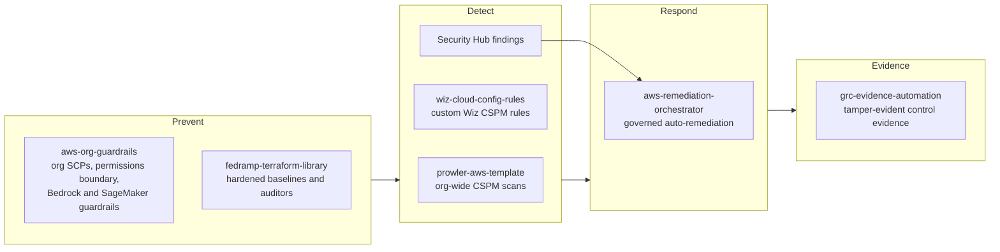

# Dustin Arrington

I build AWS defenses against the techniques attackers actually use: stolen and over-trusted credentials, privilege escalation, persistence and resource hijacking. Then I try to break them.

Every control here is tested as policy behavior in CI, and most have been probed against a live four-account AWS organization. Each repo documents what was tested and what was not.

## Threat-informed hardening

When a new AWS attack technique shows up in incident reports, I trace it to a control, ship the control, and add a regression check. The [threat response log](THREAT-RESPONSE.md) has 43 entries since September 2026, each tagged with MITRE ATT&CK techniques and linked to public reporting. A few:

| Technique | What I shipped |
|---|---|
| Privilege escalation by passing a more privileged role, or trusting every principal ([T1078.004](https://attack.mitre.org/techniques/T1078/004/)) | Auditor reports `iam:PassRole` on all roles and trust policies that allow any principal or an outside account without `sts:ExternalId`: [grc-evidence-automation#48](https://github.com/DustyStudy/grc-evidence-automation/pull/48) |
| Long-lived cloud keys, broad IAM actions and cloud credentials stored in workflows ([T1552.001](https://attack.mitre.org/techniques/T1552/001/)) | Lint flags long-lived cloud keys, broad IAM actions and stored cloud credentials in workflows: [claude-code-guardrails v0.8.0](https://github.com/DustyStudy/claude-code-guardrails/releases/tag/v0.8.0) |
| Look-alike EMR log bucket created first by an outside account reads cluster logs ([T1565.001](https://attack.mitre.org/techniques/T1565/001/), [T1530](https://attack.mitre.org/techniques/T1530/)) | Opt-in SCP denying access to EMR log buckets owned outside the organization: [aws-org-guardrails#53](https://github.com/DustyStudy/aws-org-guardrails/pull/53) |

## Start here

- [**aws-org-guardrails**](https://github.com/DustyStudy/aws-org-guardrails): stops privilege escalation, persistence and log tampering across an AWS Organization with SCPs, a permissions boundary, Identity Center permission sets and Bedrock/SageMaker guardrails. [Probed with 62 live probes](https://github.com/DustyStudy/aws-org-guardrails/blob/main/docs/PROOF.md).
- [**aws-remediation-orchestrator**](https://github.com/DustyStudy/aws-remediation-orchestrator): responds to Security Hub findings through policy, blast-radius limits and a human approval gate. [Six playbooks run against a real organization](https://github.com/DustyStudy/aws-remediation-orchestrator/blob/main/docs/PROOF.md), and [one finding traced from detection to evidence](https://github.com/DustyStudy/aws-remediation-orchestrator/blob/main/docs/CASE-STUDY.md).
- [**ai-agent-security-toolkit**](https://github.com/DustyStudy/ai-agent-security-toolkit): prompt-injection fuzzer, tool-call sandbox with taint tracking, output validation and a tamper-evident audit log for LLM agents. [Fuzzed with 500 attacks against a local Llama 3.1 8B model](https://github.com/DustyStudy/ai-agent-security-toolkit/blob/main/docs/PROOF.md): forbidden tool calls, leaks and exfiltration went from 65 to zero.

## How the repos fit together

```mermaid
flowchart LR
  subgraph prevent["Prevent"]
    org["aws-org-guardrails<br/>org SCPs, permissions boundary,<br/>Bedrock and SageMaker guardrails"]
    lib["fedramp-terraform-library<br/>hardened baselines and auditors"]
  end
  subgraph detect["Detect"]
    prowler["prowler-aws-template<br/>org-wide CSPM scans"]
    wiz["wiz-cloud-config-rules<br/>custom Wiz CSPM rules"]
    sh["Security Hub findings"]
  end
  subgraph respond["Respond"]
    rem["aws-remediation-orchestrator<br/>governed auto-remediation"]
  end
  subgraph prove["Evidence"]
    grc["grc-evidence-automation<br/>tamper-evident control evidence"]
  end
  prevent --> detect --> respond
  sh --> rem
  respond --> prove
```

## More projects

- [**fedramp-terraform-library**](https://github.com/DustyStudy/fedramp-terraform-library): 23 hardened AWS account baseline modules and read-only auditors, with plan-time tests of the rendered IAM and bucket policies. [Sixteen deployed and probed in a real organization](https://github.com/DustyStudy/fedramp-terraform-library/blob/main/docs/LIVE-PROOF.md), where the read-only trust-policy auditor found a GitHub OIDC deploy role that any branch could assume. Mapped to NIST 800-53 Rev5 and FedRAMP.
- [**prowler-aws-template**](https://github.com/DustyStudy/prowler-aws-template): org-wide Prowler scans through GitHub Actions and OIDC, with a [documented cost model](https://github.com/DustyStudy/prowler-aws-template/blob/main/docs/COST.md). [Run against a real four-account organization](https://github.com/DustyStudy/prowler-aws-template/blob/main/docs/PROOF.md).
- [**wiz-cloud-config-rules**](https://github.com/DustyStudy/wiz-cloud-config-rules): custom Wiz Cloud Configuration Rules in Rego, GovCloud-safe, with 162 `opa test` cases.
- [**claude-code-guardrails**](https://github.com/DustyStudy/claude-code-guardrails): guardrails for AI coding agents on AWS and Terraform that block risky commands and catch secrets before they are written.
- [**grc-evidence-automation**](https://github.com/DustyStudy/grc-evidence-automation): scheduled, tamper-evident control evidence for SOC 2, ISO 27001, NIST 800-53 and FedRAMP 20x. [Deployed and verified in a live account](https://github.com/DustyStudy/grc-evidence-automation/blob/main/docs/live-deployment-verification.md).

## Engineering notes

[Design decisions and deployment evidence](ENGINEERING.md): how a finding moves through the system, what the live runs establish, and the cost and operating limits of each.

## Tools and platforms

**Cloud:** AWS, including GovCloud 
**Security:** Security Hub, GuardDuty, AWS Config, IAM Access Analyzer, Prowler, Wiz, OPA/Rego, Checkov, Trivy, Gitleaks, MITRE ATT&CK 
**Infrastructure as code:** Terraform, GitHub Actions (OIDC, no static keys) 
**Languages:** Python, HCL, Rego, PowerShell, Bash 
**Compliance:** NIST 800-53 Rev5, FedRAMP Rev5 and 20x, SOC 2, ISO 27001:2022. I map controls to these frameworks; they aren't the goal. 
**AI assistance:** I use AI coding assistants (Claude Code) for drafting and review. I design each system, and I verify it with tests and, where noted, live deployments.
